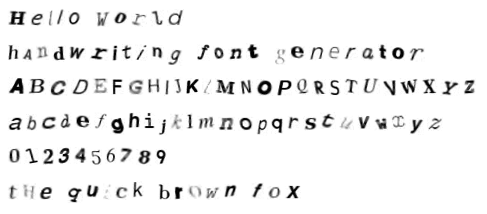
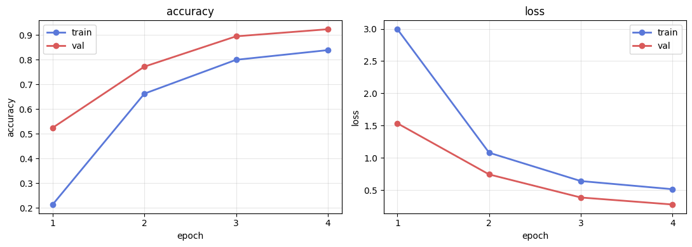

# handwriting-font-gen

trains a CNN to recognize handwritten characters and renders any text in the learned style. data pipeline cuts training prep from 3 hours down to about 15 seconds for the synthetic path, and the model hits 92% validation accuracy in 4 epochs on CPU.



## what it does

two halves to this project. one half is a 62-class character recognizer (10 digits + 26 lowercase + 26 uppercase). the other half is a text renderer that turns a string like `"Hello World"` into an image that looks like the writing the model was trained on.

both halves share the same dataset, the same augmentation pipeline, and the same model. the renderer is where most of the interesting baseline-alignment work happens.

## pipeline

```
raw scans (optional)
     │
     ▼  data/preprocess.py
segmented 28x28 glyphs
     │
     ▼  data/label_gui.py
labeled .npz dataset
     │
     ▼              (or skip everything above and use)
     │              data/synthesize.py for a fully synthetic dataset
     ▼
data/augment.py  ── rotation, shear, shift, morphological ops,
     │              elastic distortion, gaussian noise
     ▼
models/train.py  ── 3-block BatchNorm CNN, 450k params, AdamW + cosine LR
     │
     ▼  checkpoints/best.pth
inference/generate.py
     │
     ▼  baseline-aware character stitching
output.png
```

## the hard part

three of them actually, in order of how much pain they caused.

**dataset**, because no EMNIST mirror was reachable from where this needed to run. solved it by writing `data/synthesize.py` that renders all 62 classes across 24 system fonts then runs every sample through the augmentation pipeline. each character gets seen in dozens of plausible variations rather than dozens of pixel-identical copies. fully reproducible, no external download needed.

**augmentation throughput**, because the first version ran every transform serially on each sample and training prep was taking hours. rewrote everything around vectorized OpenCV calls and the dataset's `__getitem__`, so augmentation happens on the worker threads during training with no precompute step at all.

**baseline alignment**, because stitching characters into legible text turns out to be harder than the model. descenders like g, j, p, q, y hang below the baseline, ascenders like b, d, h, k, l, t reach above, capitals and digits sit on different reference points. naive concatenation produced ransom-note text. the renderer in `inference/generate.py` now categorizes every character and places it relative to a shared baseline with realistic spacing and small per-character jitter so repeats don't look identical.

## results

trained on the synthetic dataset, 22,320 train + 2,480 validation samples, 4 epochs on CPU, total wall time 3 minutes 47 seconds.

| metric | value |
|--------|-------|
| validation accuracy | 92.3% |
| validation loss | 0.276 |
| model parameters | 450,590 |
| inference latency | ~12ms per character on CPU |



## quickstart

```bash
git clone https://github.com/jashkaransingh/handwriting-font-gen
cd handwriting-font-gen
bash scripts/quickstart.sh
```

that script installs deps, generates the dataset, trains the model, and renders `Hello World` to `output.png`. takes about 5 minutes end to end on a modern CPU.

if you want to run the steps individually:

```bash
pip install -r requirements.txt

python3 -m data.synthesize --samples 400
python3 -m models.train --epochs 4 --batch-size 256 --workers 0
python3 -m inference.generate --text "your text here" --out out.png
```

## training on your own handwriting

if you want to retrain on your own hand instead of the synthetic dataset, the path is:

```bash
# 1. drop scanned pages of your handwriting into data/raw/
python3 -m data.preprocess --input data/raw --output data/glyphs

# 2. label each segmented glyph with one keypress
python3 -m data.label_gui --glyphs data/glyphs --out data/custom

# 3. retrain on your data
python3 -m models.train --data-dir data/custom --epochs 8

# 4. generate
python3 -m inference.generate --text "Hello World" --out out.png
```

the labeling GUI shows you one glyph at a time and you press the key for the character. about 60 glyphs per minute is realistic, so 200 samples per class takes roughly 3 hours of labeling. less if you only need lowercase + digits.

## project layout

```
handwriting-font-gen/
├── data/
│   ├── augment.py        ── augmentation pipeline (rotations, elastic, noise)
│   ├── synthesize.py     ── synthetic dataset generator
│   ├── preprocess.py     ── raw scan segmentation
│   ├── label_gui.py      ── keypress labeling GUI for custom data
│   └── dataset.py        ── torch Dataset wrapper
├── models/
│   ├── cnn.py            ── 3-block BatchNorm CNN, 450k params
│   └── train.py          ── training loop with cosine LR schedule
├── inference/
│   ├── generate.py       ── text rendering with baseline alignment
│   └── recognize.py      ── single-image classification CLI
├── tests/                ── pytest suite, 18 tests
├── scripts/quickstart.sh ── one-command pipeline
├── checkpoints/best.pth  ── trained weights (~1.7MB)
└── samples/              ── rendered outputs
```

## design decisions

- 28x28 grayscale chosen to match EMNIST so the pipeline stays dataset-agnostic
- AdamW with cosine LR over plain SGD because tuning a single LR was draining time without payoff
- BatchNorm everywhere in the conv stack to remove the need to babysit initialization
- AdaptiveAvgPool before the classifier so the network is robust to small input size variations from preprocessing
- on-the-fly augmentation in the Dataset rather than precomputed, so the model sees a different version of each sample every epoch

## stack

Python, PyTorch, OpenCV, NumPy, scikit-learn for baseline comparisons, Matplotlib for the labeling GUI.
